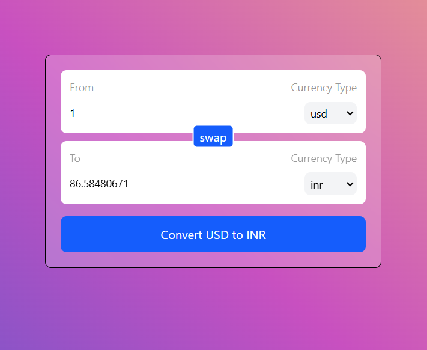

# Currency Converter

A simple currency converter built using React that allows users to convert amounts between different currencies.

## Preview


## Features
- Select currencies from dropdown menus.
- Swap the 'From' and 'To' currencies.
- Convert amount based on exchange rates.
- Responsive UI with a clean design.

## Technologies Used
- React
- Tailwind CSS
- Custom Hooks

## Installation
1. Clone the repository:
   ```sh
   git clone https://github.com/Pushpraj1522002/currency-converter.git
   ```
2. Navigate to the project folder:
   ```sh
   cd currency-converter
   ```
3. Install dependencies:
   ```sh
   npm install
   ```
4. Start the application:
   ```sh
   npm run dev
   ```

## Project Structure
```
├── src
│   ├── components
│   │   ├── InputBox.js
│   ├── hooks
│   │   ├── useCurrencyInfo.js
│   ├── App.js
│   ├── index.js
│── public
│── package.json
│── README.md
```

## Usage
1. Enter an amount in the 'From' currency box.
2. Select currencies from the dropdown menus.
3. Click the **Convert** button to see the converted amount.
4. Use the **Swap** button to switch currencies.

## API Reference
This project fetches real-time currency exchange rates from the following API:
```javascript
let api = `https://cdn.jsdelivr.net/npm/@fawazahmed0/currency-api@latest/v1/currencies/${currency}.json`
```
- Currency API by @fawazahmed0

## Courtesy
This project is inspired by and follows guidance from **[Chai Aur Code](http://www.youtube.com/@chaiaurcode)**.

## Author
[Pushpraj Desai](https://github.com/Pushpraj1522002)

